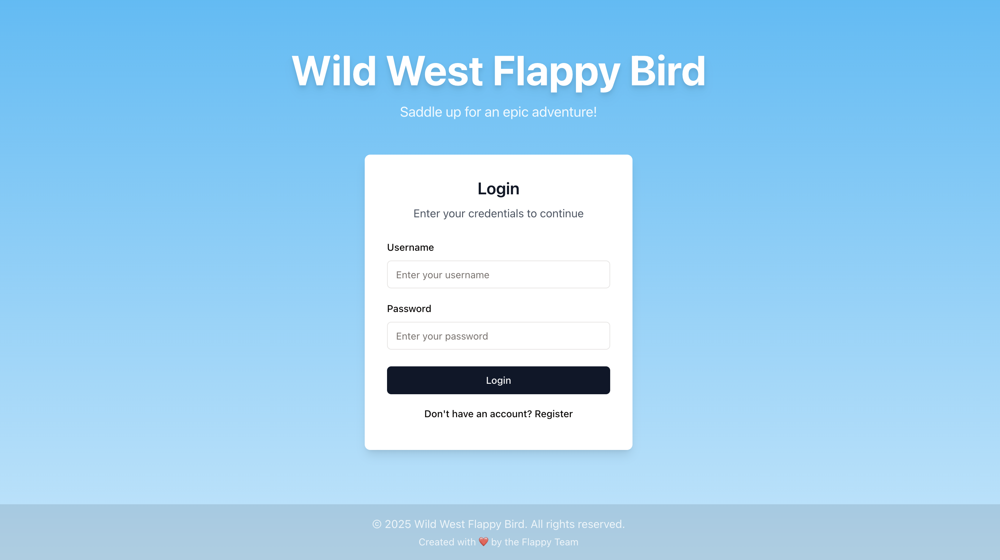
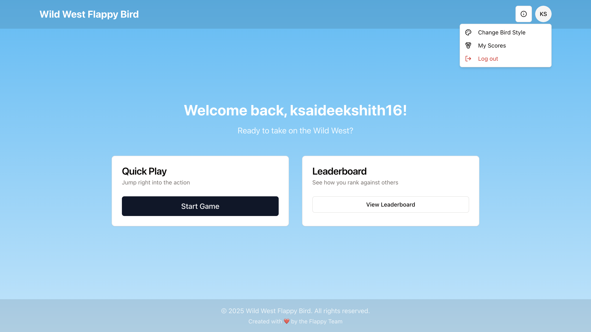
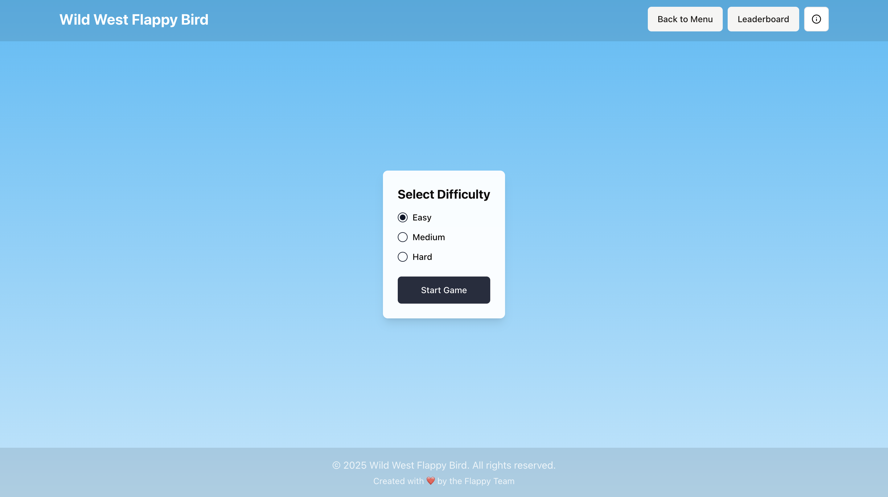
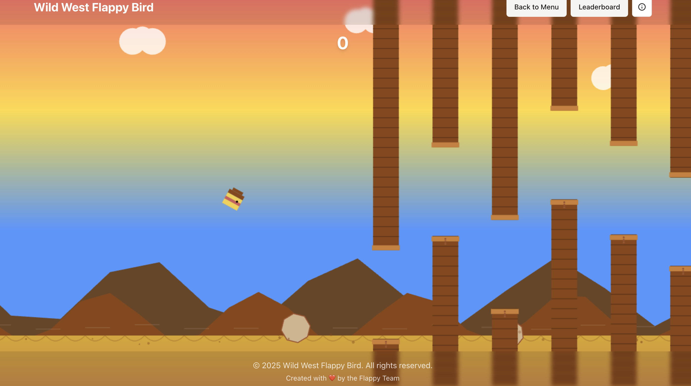

# 🤠 Wild West Flappy Bird

A dynamic Wild West-themed arcade game delivering an immersive bird-flying experience with competitive and personalized gameplay mechanics. Navigate through challenging environments in this unique western twist on the classic Flappy Bird game.

## 🎮 Features

- **Multiple Difficulty Levels**: Choose between Easy, Medium, and Hard modes
- **Western-Themed Graphics**: Unique cowboy-styled birds and desert environment
- **Particle Effects**: Dynamic dust particles and visual effects
- **Sound Effects**: Western-themed audio and background music
- **Leaderboard System**: Compete with other players across different difficulty levels
- **Customizable Birds**: Choose different bird styles (cowboy, sheriff, bandit, prospector)
- **User Authentication**: Save your progress and compete with others
- **Responsive Design**: Play on any device

## 🎯 How to Play

1. Log in or register to start playing
2. Select your preferred difficulty level:
   - **Easy**: Slower pace with comfortable gaps between pipes
   - **Medium**: Balanced speed and moderate pipe spacing
   - **Hard**: Fast-paced with challenging alternating pipe heights
3. Click or press any key to make your bird flap
4. Navigate through the pipes to score points
5. Try to beat your high score!

## 🎨 Bird Styles

- Cowboy (Default)
- Sheriff
- Bandit
- Prospector

## 🔧 Technical Stack

- **Frontend**:
  - React.js
  - TypeScript
  - Tailwind CSS
  - shadcn/ui components
  - Canvas API for game rendering
  - Web Audio API for sound effects

- **Backend**:
  - Express.js
  - PostgreSQL database
  - Drizzle ORM
  - JWT authentication
  - WebSocket for real-time updates

## 💻 Development Setup

1. Clone the repository
2. Install dependencies:
   ```bash
   npm install
   ```
3. Set up the database:
   ```bash
   npm run db:push
   ```
4. Start the development server:
   ```bash
   npm run dev
   ```
5. Open [http://localhost:5000](http://localhost:5000) in your browser

## 🎵 Audio Credits

All sound effects and background music are royalty-free and themed to match the Wild West atmosphere.

## 👥 Contributing

Feel free to submit issues and enhancement requests!

## 📜 License

© 2025 Wild West Flappy Bird. All rights reserved.


## 🖼️ Screenshots

Here are some screenshots of the Wild West Flappy Bird game:

### Login Screen


### Main Menu


### Difficulty Selection


### Gameplay



## 🌐 Play the Game Online

The Wild West Flappy Bird game is live! Play it here:

[https://flappy-nest-clone-ksaideekshith.replit.app/](https://flappy-nest-clone-ksaideekshith.replit.app/)
